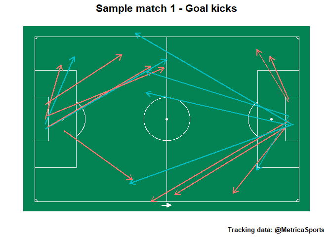

## View data

``` r
dtData$dtTrackingData %>%
  str(give.attr=FALSE)
dtData$dtEventsData %>%
  str(give.attr=FALSE)
dtData$dtEventsData %>%
  select("Type") %>%
  distinct()
dtData$dtEventsData %>%
  select("Subtype") %>%
  distinct()
dtData$dtEventsData %>%
  select("Type","Subtype") %>%
  distinct()
```

## Events

``` r
goal_kicks <- dtData$dtEventsData %>%
  filter(Subtype=="GOAL KICK")

corner_kicks <- dtData$dtEventsData %>%
  filter(Subtype=="CORNER KICK")
```

## Slice

``` r
fGetTrackingSlice <- function(dtTrackingData, frame, before=0, after=0){
  
  dtTrackingSlice <- dtTrackingData %>%
    filter(Frame %in% outer(frame,-before:after,"+"))

  return(dtTrackingSlice)
}

dtTrackingSlice <- fGetTrackingSlice(
  dtData$dtTrackingData,
  frame=corner_kicks$StartFrame[c(2)],
  before=10,
  after=150
)

# framesinslice <- dtTrackingSlice %>%
#   select(Frame) %>%
#   distinct()
```

## Voronoi

``` r
voronoiOutput <- fDrawVoronoiFromTable(
   dtTrackingSlice = dtTrackingSlice,
   nXLimit = 120,
   nYLimit = 80,
   UseOneFrameEvery = 2,
   DelayBetweenFrames = 4
)
```


## Maps

``` r
pPitch <- fAddPitchLines(ggplot()) + theme_pitch()

pPitch +
  geom_segment(data=goal_kicks,aes(x=EventStartX,y=EventStartY,xend=EventEndX,yend=EventEndY,colour=Team),size=1, arrow=arrow(length = unit(0.03, "npc"))) +
  theme(
    plot.title=element_text(size=16, hjust=0.5, face="bold"),
    plot.caption=element_text(size=10, face="bold"),
    legend.position="none"
  ) +
  labs(
    title="Sample match 1 - Goal kicks",
    caption="Tracking data: @MetricaSports"
  )
```

<!-- -->

``` r
ggsave((here("plots","tracking","goalkicks.jpg")))
```
