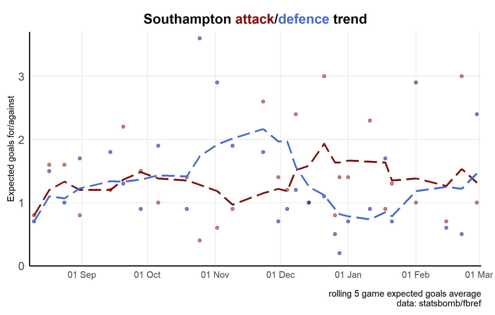
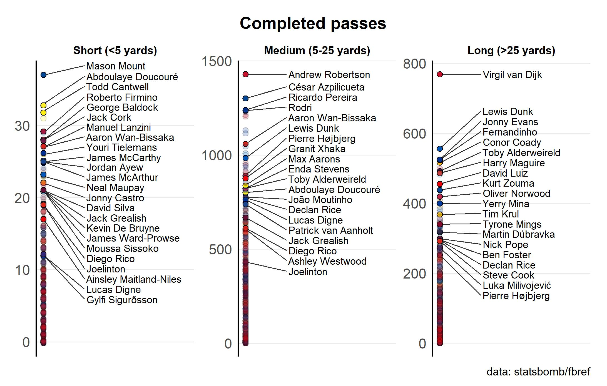
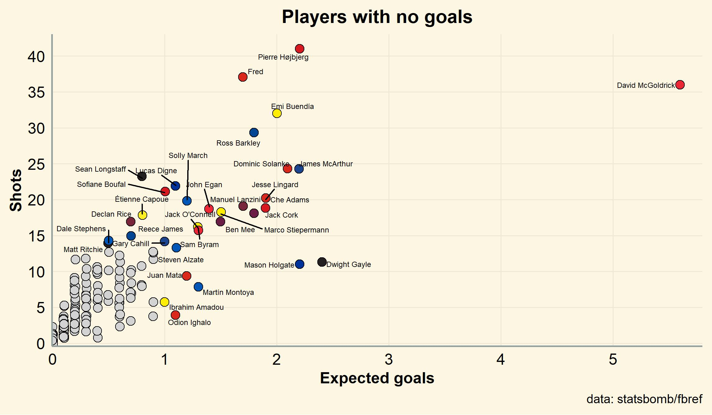

## Football analytics repository

### Structure

* [R/raw/](https://github.com/szfh/football-stats/tree/main/R/raw) for scripts to get data from public sources and save to a .RDS file. **[See note below](https://github.com/szfh/football-stats#note-about-scraping)**.
* [R/join/](https://github.com/szfh/football-stats/tree/main/R/join) for data preparation and import to the R workspace.
* [R/plot/](https://github.com/szfh/football-stats/tree/main/R/plot) for scripts to create and save images. Called from  [/plot.R](https://github.com/szfh/football-stats/blob/main/R/plot/plot.R).
* [R/library.R](https://github.com/szfh/football-stats/blob/main/R/library.R) for packages.
* [R/themes.R](https://github.com/szfh/football-stats/blob/main/R/themes.R) for themes.
* [@saintsbynumbers](https://twitter.com/saintsbynumbers) for the author.

### Note about scraping

Most data in this repository is collected using [worldfootballR](https://cran.r-project.org/web/packages/worldfootballR/index.html) by [Jason Zivkovic](https://www.dontblamethedata.com/). This is done by scanning public data sources for new data, downloading, and then adding to an existing dataset. That way the bandwidth impact on the public data source is minimised.

If you use scraping tools including any in this repository, **you must use them responsibly**. Download once, save locally, and work from there. Credit the data sources in your work. Data is provided for free, so don't ruin it for everyone.

### Useful resources

1. [Friends of Tracking](https://www.youtube.com/channel/UCUBFJYcag8j2rm_9HkrrA7w)
1. [Devin Pleuler Analytics Handbook](https://github.com/devinpleuler/analytics-handbook)
1. [John Burn-Murdoch clubelo script](https://gist.github.com/johnburnmurdoch/1b3f32aaf7757733bd68a6513ab86226) with
    [link to Tweet](https://mobile.twitter.com/jburnmurdoch/status/1075088086370013184)

## Data visualisation

