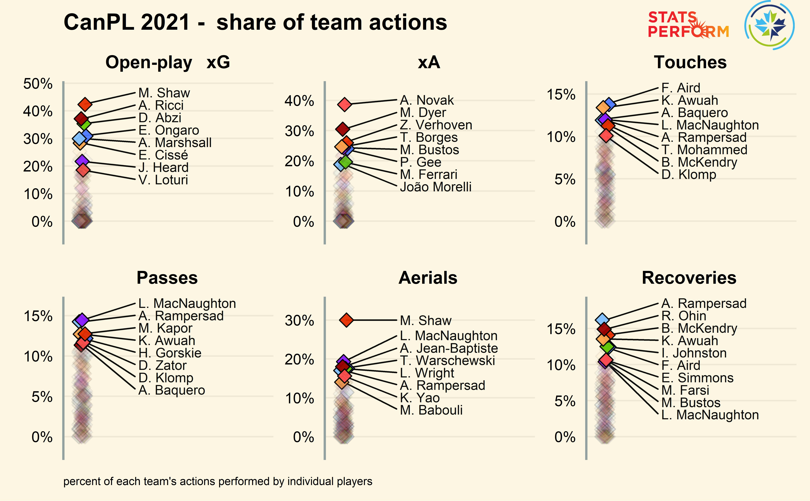

## Football analytics repository

### Written by

[@saintsbynumbers](https://twitter.com/saintsbynumbers)

### Useful resources

1. [Friends of Tracking](https://www.youtube.com/channel/UCUBFJYcag8j2rm_9HkrrA7w)
1. [Devin Pleuler Analytics Handbook](https://github.com/devinpleuler/analytics-handbook)
1. [John Burn-Murdoch clubelo script](https://gist.github.com/johnburnmurdoch/1b3f32aaf7757733bd68a6513ab86226) with
    [link to Tweet](https://mobile.twitter.com/jburnmurdoch/status/1075088086370013184)

## Data visualisation

